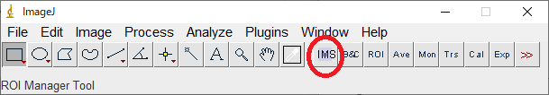
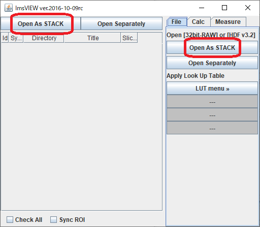
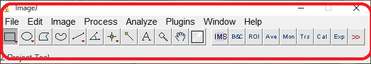

###  目的
この記事を読むと，SCAPSデータの開き方・保存の方法がわかります．

### 開き方
【事前準備】同位体顕微鏡の測定データは、ImageJにImsVIEWプラグインを入れると開くことができます。（入れ方は、トピック「[ImsVIEWのインストール方法](/download/)」を見て下さい）

【ファイルの種類】SCAPSで取ると，加算前のデータと，加算したデータの2種類が保存されます．基本的に，加算したあとのデータしか使いません．

【手順】
1. メニューバーの"IMS"アイコンをクリックすると、ImsVIEWのウィンドウが開きます．   
   

2. ここの"Open as Stack"にファイルをドラッグ＆ドロップして下さい。同じボタンが２つありますが、機能は同じです。
データファイルを複数選択してドラッグ、フォルダごとドラッグ、どちらもOKです。非対応ファイルは無視されます。    
    

TIFFやPNGなどの画像ファイルは、ImsVIEWではなくて、ImageJのメニューウィンドウにドラッグ＆ドロップすると開きます。  
   
{: .notice--info}

3. ドロップされたファイルは、ファイル名順にスタックされた新しい画像ウィンドウが開きます。

4. スタックにしたくない場合は、右隣の"Open Separately"にドラッグ＆ドロップして下さい。ファイルごとに画像ウィンドウが開きます。
     

開いている画像の名前変更は、下記のいずれかでできます．  
-ImageJの"Image"メニュー>"Rename..."  
-ImsVIEWウィンドウの左側ファイルリストのTitle列をクリック（修正後にEnter）
{: .notice--info}

### 保存の仕方
【再度解析したい場合】   
- Edit>save as>tiffで保存されます．この時，保存されるデータは，32bitのtiffファイルです．Tiffファイルは，図の生データを圧縮も何もなく保存するので，Tiffで保存したデータを用いても，生データを扱うのと全く同じようにSCAPSのデータを解析することができます．ただし，他のプログラムで開くことは困難です．   
【画面に表示されている通りの絵を保存し，他のプログラムで使用したい場合】
- Edit>save as>pngで保存してください．画面に表示されている通りの絵が保存されます．しかし，このデータは，生データが持っている階調とカウントの整合性が失われているので，解析には使用できません．論文資料に書き出す場合などには，行ってください．

**Watch out!** pngで保存すると，tiff/生データではなく，pngに変換したあとのデータが画面に表示されている可能性があります．その場合，正しく解析できません．pngファイルで保存する前に，tiffで保存しておきましょう．また，pngで保存したら，一旦，そのファイルを閉じて再度開きましょう．
{: .notice--danger}

**Watch out!** jpgで保存すると汚くなりがちなので，おすすめしません．
{: .notice--warning}