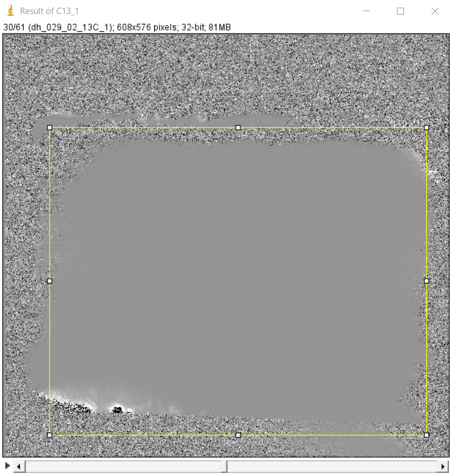
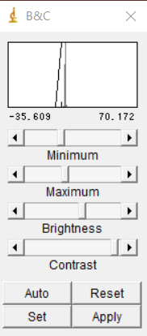
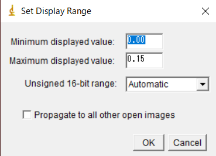

###  目的
この記事を読むと，像を見やすくする方法がわかります．

### 明るさ・コントラストの調整
【事前準備】像の開き方・保存の仕方は，(こちら)[/analysis/open_data/]を参照ください．

【下準備】最初ひらくと，このように，像が見えないこともあります．明るさとコントラストを調整しましょう．
   
1. ツールバーの「B&C」をクリックするとダイアログが表示されます．    
      
2. 調整を行う部分をツールバーの左側の資格ツールなどで選択し，「Auto」をクリックします．  (画面左の黄色い部分)
3. より厳密に設定する場合には，最大値と最小値を設定します．    
　「B&C」のダイアログにある「set」をクリックして、値を設定できます．    

### LUTを使用し，色に意味のある疑似カラー像を作る
1. 画像カラーを変える場合は、「Image」＞「Lookup tables」から変更します．
2. 上記の「明るさ・コントラストの調整 #3」最大値と最小値の設定で，LUTの端点をあわせます．